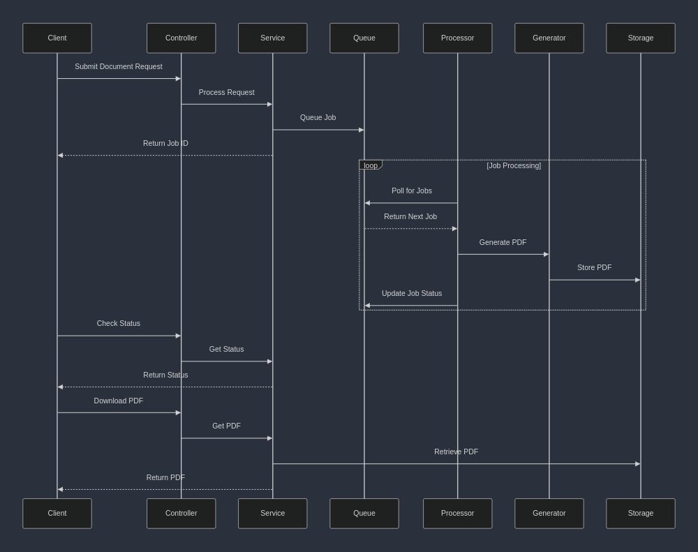

# Floppy PDF generator

## Requirements
* Java 21
* Gradle 8

## Modules
There are two modules in this project: Pokemon and core.

### Core library
The core library contains the pdf generation, queuing, style loading and storage service. These components are meant to be used by other services to load and convert any sort of input data into XML and then convert it to PDF using a .XSLT template.

### Pokemon library
The Pokemon library is a standalone consumer library which uses to Core lib to generate different Pokemon related PDF's via typed controller endpoints.
This module uses Spring web MVC to create controllers which can be used to.

#### Templates
Currently there are three different formats created for converting data into Pokemon pdf's. These are stored in the pokemon resource folder.
They demonstrate different approaches for how to create the .xsl template files and how they can be organized.

### Running the project

#### Bootrun
Run the pokemon project directly in the console
`./gradlew :pokemon:bootrun`

#### Docker
Build docker image
`./gradlew :pokemon:bootBuildImage`
Run docker image
`docker run -p 8080:8080 --mount type=bind,source=./pdf-storage,target=/workspace/pdf-storage  -t docker.io/library/pokemon:0.0.1-SNAPSHOT`

### Usage
Use the swagger api for a demonstration: [Swagger](http://localhost:8080/swagger-ui/index.html#/)

Check the [Demo folder](./demo-inputs) for example input which can be used.
Check the [Pdf storage](./pdf-storage) for example pdf's that have been created

Generated pdf's will be put into the pdf-storage folder

### architecture
